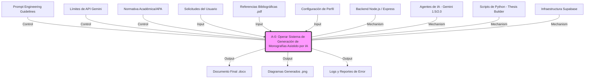
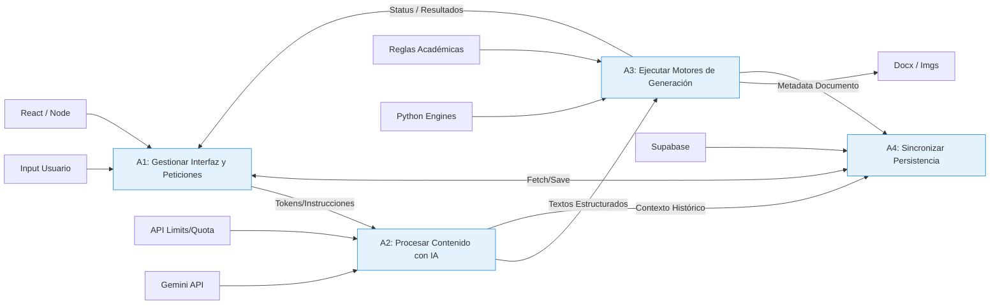

# Diagrama IDEF0: Sistema de Generación de Monografías Asistido por IA (GMA-IA)

Este documento describe el funcionamiento técnico del sistema GMA-IA, estructurado bajo el estándar IDEF0 para mostrar la jerarquía funcional y flujos de datos.

## Nivel A-0: Contexto del Sistema

El sistema GMA-IA integra tecnologías web, procesamiento de lenguaje natural y scripts de automatización para producir documentos académicos.

---

## Nivel A0: Descomposición Funcional del Sistema

Se detallan los módulos técnicos y su interacción interna.

## Glosario Técnico (ICOM)

| Sigla | Nombre | Descripción Técnica |
| :--- | :--- | :--- |
| **I** | Inputs | Datos crudos, archivos PDF para RAG, prompts del usuario y parámetros de la tesis. |
| **C** | Controles | Restricciones de tokens de la API, librerías de validación de formato (docx-templates), y configuración del sistema. |
| **O** | Outputs | Archivos Microsoft Word generados, diagramas Ishikawa/IDEF en PNG, y el estado de la base de datos. |
| **M** | Mecanismos | Stack tecnológico: React (Frontend), Node.js (Backend), Python (Generación de archivos), Supabase (Base de Datos) y Gemini (IA). |
